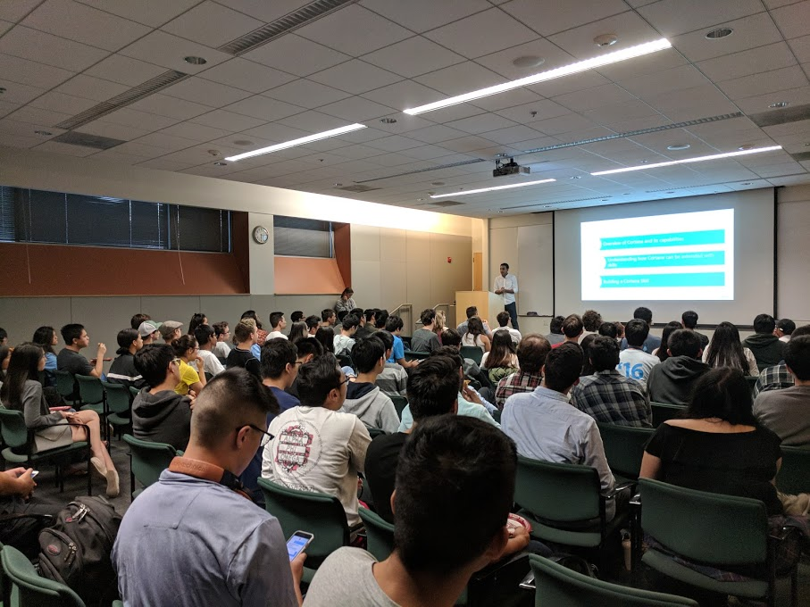
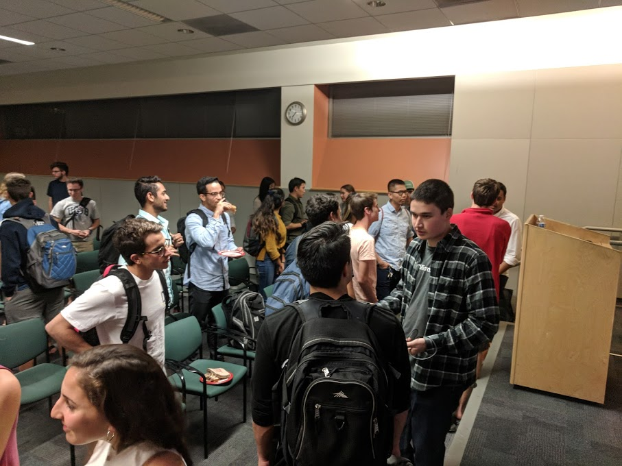

# Data Talk #1: Microsoft 

On Friday, October 20th, 2017, the Data Science club at UCSB hosted a Data Talk with Microsoft, where guest speaker Vivek Goswami talked about Cortana. Attendees came out to a night of free T-shirts, free pizza, and a networking session with Microsoft recruiters. 

The Data Talk began with an introduction of Vivek Goswami, a UCSB alumni who is currently a product manager for the Cortana Platform Team. He began his talk with a video showcasing the functions of Cortana. He then demonstrated Cortana's abilities by attempting to place reservations at the Black Sheep. 

"Cortana is "productive, personal, unbounded, and proactive". - Vivek Goswami

Goswami then introduced the Cortana Skills Kit, a developer platform designed to connect users with experts. The Cortana Skills Kit allows developers to create skills using data from Cortana's knowledge as well as from Bing Search. Goswami defined a **skill** as: a unit of conversational intelligence that enables Cortana to help users using your services. 

Goswami described the process of building a Cortana Skill into three major steps: 

**1.** Use the Bot Framework to create the skill logic  
**2.** Add Cortana to the channel  
**3.** Publish your skill  

Goswami then used a live demonstration to create a skill that spewed facts about UCSB. He began with naming the skill and choosing a language for the skill (C# or NodeJS). He then had to generate an App ID and a password. He then tested the skill by having Cortana echo back inputted text. Goswami proceeded to build the "UCSB Facts" skill, adding in an icon, name, and description for the skill. He finished the demonstration by publishing the skill and performing a live test of the "UCSB Facts" skill. 

Goswami finished his talk with a FAQ session, which then moved on into a networking session. Attendees had the opportunity to talk with Microsoft recruiters and receive feedback on their resumes. 

Stay tuned to our [Facebook](https://www.facebook.com/DataScienceUCSB/) to find out when our next Data Talk is! 